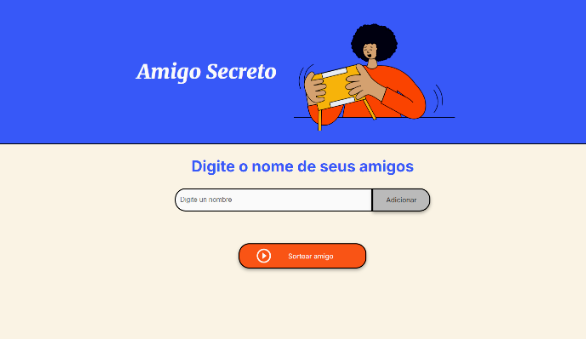
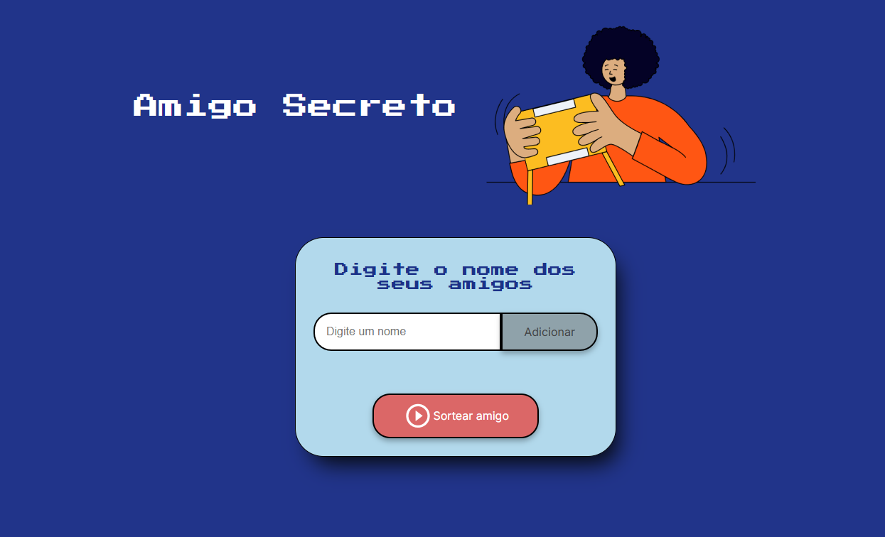

# Challenge - Amigo Secreto - ONE (G8)
## Objetivo do Challenge
O challenge teve o objetivo de testar nosso conhecimento adquirido com os cursos de formação em lógica de programação.
## Detalhes do Projeto
O projeto tem como seu principal objetivo obter a entrada de dados do usuário (Nome das pessoas), mostrar a lista na tela do site, e por fim fazer o sorteio de forma aleatória para saber qual nome foi sorteado.
## Linguagens Utilizadas
  

## Como utilizar o Projeto
1. Abra o projeto em um navegador
2. Coloque o nome da pessoa e clique em "Adicionar"
3. Abaixo irá aparecer a lista de nomes adicionados
4. Depois de adicionado, clique e "Sortear Amigo"
5. E no fim, aparecerá o nome sorteado.

    

> Projeto Inicial

    

> Meu projeto final